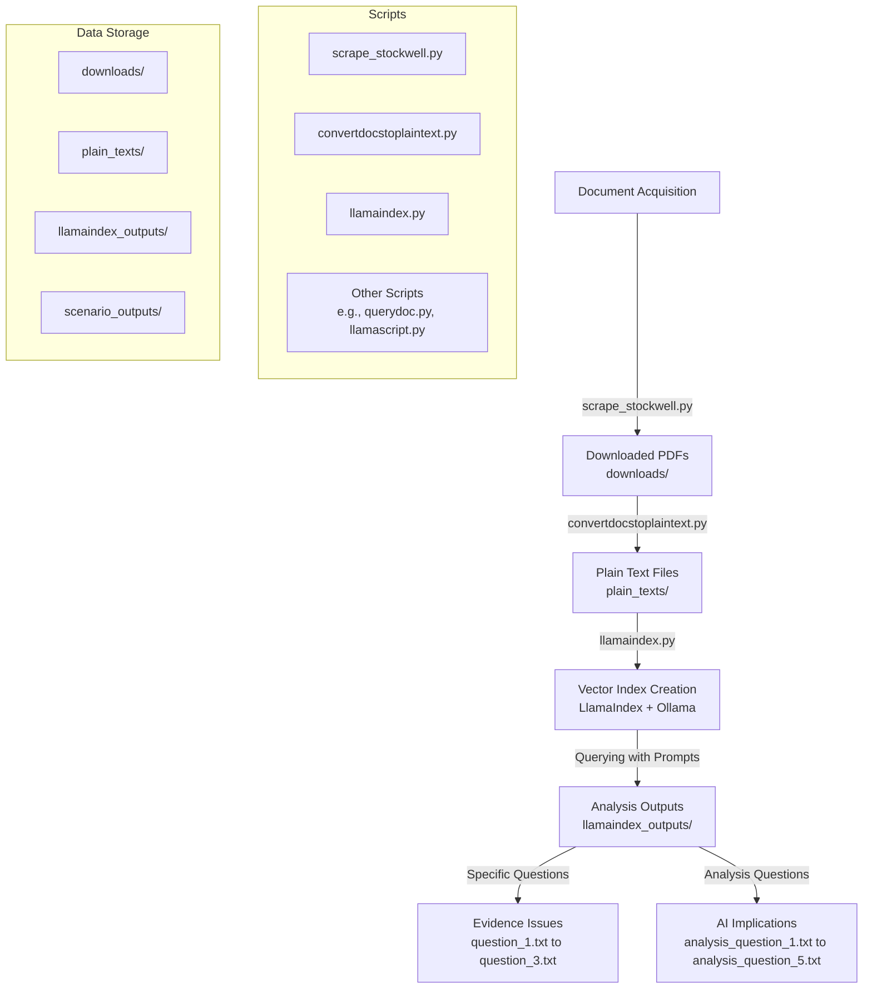

# Repository Workflow Diagram

Below is a Mermaid flowchart illustrating the workflow and key components in the repository for analyzing inquest documents using AI. This diagram shows the process from document acquisition to generating analysis outputs.

## Explanation of the Workflow

1. **Document Acquisition**: The process begins with acquiring documents, primarily PDFs related to the Jean Charles de Menezes inquest, using `scrape_stockwell.py`.
2. **PDF to Text Conversion**: These PDFs are converted to plain text files using `convertdocstoplaintext.py` and stored in the `plain_texts/` directory.
3. **Vector Index Creation**: The `llamaindex.py` script builds a vector index over these text files using LlamaIndex and Ollama (with models like Llama3 and nomic-embed-text).
4. **Querying and Analysis**: The script then queries this index with predefined prompts to generate outputs, which are saved in `llamaindex_outputs/`.
5. **Output Categories**: Outputs are divided into specific evidence-related questions (e.g., issues with CCTV, police statements) and broader analysis questions about AI implications in legal contexts (e.g., speed of analysis, transparency challenges).

This diagram and explanation should help visualize the data flow and processing steps within your repository.

## Analysis Questions

Below are the analysis questions used in `llamaindex.py` to explore the implications of using AI/NLP in the context of inquests. These questions are queried against the vector index to generate detailed responses saved in `llamaindex_outputs/`:

1. **Speed and Quality of Legal Analysis**: How might using AI/NLP to summarize and interrogate inquest documents affect the speed and quality of legal analysis? Provide specific examples of potential time savings and discuss how the quality of analysis might be impacted by AI's strengths and weaknesses in understanding legal nuances. Compare this to traditional manual methods.
2. **Detection of Inconsistencies**: Can AI help detect inconsistencies or possible evidence tampering in inquest documents? Detail specific methods or algorithms that could be used for detection, provide examples from the documents if possible, and critically evaluate the limitations of AI in this context, including risks of false positives or negatives.
3. **Balance of Power**: How could the use of AI in inquests affect the balance of power between families, police, and legal teams? Analyze potential scenarios where AI might empower or disadvantage each party, discuss the role of data access and algorithmic bias, and suggest safeguards to ensure fairness.
4. **Transparency and Accountability**: What are the transparency and accountability challenges when using AI to process legal evidence? Explore specific issues such as the opacity of AI decision-making, the risk of biased training data, and the potential erosion of human oversight. Propose detailed measures to address these challenges.
5. **Innovative Applications**: In what other ways could AI be used in inquests beyond evidence review and summarization? Brainstorm innovative applications such as predictive analytics, real-time assistance during hearings, or public engagement tools, and critically assess the feasibility and ethical implications of each idea.
