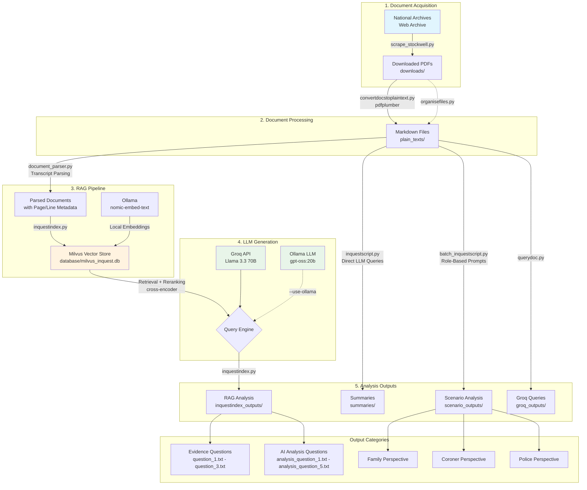

# Repository Workflow Diagram

Below is a Mermaid flowchart illustrating the workflow and key components in the repository for analyzing inquest documents using AI. This diagram shows the process from document acquisition to generating analysis outputs.

```mermaid
flowchart TD
    subgraph "1. Document Acquisition"
        A[National Archives<br/>Web Archive] -->|scrape_stockwell.py| B[Downloaded PDFs<br/>downloads/]
    end
    
    subgraph "2. Document Processing"
        B -->|convertdocstoplaintext.py<br/>pdfplumber| C[Markdown Files<br/>plain_texts/]
        B -.->|organisefiles.py| C
    end
    
    subgraph "3. RAG Pipeline"
        C -->|document_parser.py<br/>Transcript Parsing| D[Parsed Documents<br/>with Page/Line Metadata]
        D -->|inquestindex.py| E[Milvus Vector Store<br/>database/milvus_inquest.db]
        F[Ollama<br/>nomic-embed-text] -->|Local Embeddings| E
    end
    
    subgraph "4. LLM Generation"
        E -->|Retrieval + Reranking<br/>cross-encoder| G{Query Engine}
        H[Groq API<br/>Llama 3.3 70B] --> G
        I[Ollama LLM<br/>gpt-oss:20b] -.->|--use-ollama| G
    end
    
    subgraph "5. Analysis Outputs"
        G -->|inquestindex.py| J[RAG Analysis<br/>inquestindex_outputs/]
        C -->|inquestscript.py<br/>Direct LLM Queries| K[Summaries<br/>summaries/]
        C -->|batch_inquestscript.py<br/>Role-Based Prompts| L[Scenario Analysis<br/>scenario_outputs/]
        C -->|querydoc.py| M[Groq Queries<br/>groq_outputs/]
    end
    
    subgraph "Output Categories"
        J --> J1[Evidence Questions<br/>question_1.txt - question_3.txt]
        J --> J2[AI Analysis Questions<br/>analysis_question_1.txt - analysis_question_5.txt]
        L --> L1[Family Perspective]
        L --> L2[Coroner Perspective]
        L --> L3[Police Perspective]
    end

    style A fill:#e1f5fe
    style E fill:#fff3e0
    style H fill:#e8f5e9
    style I fill:#e8f5e9
```

## Explanation of the Workflow

### 1. Document Acquisition
- **`scrape_stockwell.py`**: Scrapes PDF/DOC files from the National Archives web archive of the Stockwell Inquest website, saving them to the `downloads/` directory.

### 2. Document Processing
- **`convertdocstoplaintext.py`**: Converts PDFs to Markdown format using `pdfplumber`, extracting text with page structure preserved.
- **`organisefiles.py`**: Utility to move converted `.pdf.md` files from `downloads/` to `plain_texts/` directory.

### 3. RAG Pipeline (inquestindex.py)
The modern RAG (Retrieval-Augmented Generation) pipeline uses:
- **`document_parser.py`**: Custom transcript parser that extracts structured metadata including page numbers, line numbers, speakers, and dates from the transcript format.
- **Milvus Lite**: Embedded vector database (`database/milvus_inquest.db`) for persistent vector storage—no Docker required.
- **Ollama Embeddings**: Local `nomic-embed-text` model for generating embeddings (no data sent externally).
- **Cross-encoder Reranking**: Uses `cross-encoder/ms-marco-MiniLM-L-6-v2` for improved retrieval precision.

### 4. LLM Generation
- **Groq API (default)**: Llama 3.3 70B for high-quality generation via cloud API.
- **Ollama LLM (optional)**: Local `gpt-oss:20b` model with `--use-ollama` flag for fully local operation.
- **Citation Verification**: Built-in validation to ensure legal accuracy with page/line references.

### 5. Analysis Scripts
| Script | Purpose | Output Directory |
|--------|---------|------------------|
| `inquestindex.py` | RAG-based analysis with vector retrieval | `inquestindex_outputs/` |
| `inquestscript.py` | Direct LLM summarization with chunking | `summaries/` |
| `batch_inquestscript.py` | Multi-perspective scenario analysis | `scenario_outputs/` |
| `querydoc.py` | Simple Groq-based document queries | `groq_outputs/` |

### 6. Output Categories
- **Evidence Questions**: Factual questions about CCTV issues, police statements, witness testimonies.
- **AI Analysis Questions**: Broader ethical/AI implications in legal contexts.
- **Scenario Outputs**: Role-based analysis from family, coroner, and police perspectives.

## Key Configuration (config.py)

| Setting | Value | Description |
|---------|-------|-------------|
| `GROQ_MODEL` | `llama-3.3-70b-versatile` | Primary LLM for generation |
| `OLLAMA_EMBEDDING_MODEL` | `nomic-embed-text` | Local embedding model |
| `CHUNK_SIZE` / `CHUNK_OVERLAP` | 512 / 128 | Document chunking parameters |
| `INITIAL_RETRIEVAL_TOP_K` | 15 | Chunks retrieved before reranking |
| `RERANK_TOP_N` | 5 | Chunks kept after reranking |
| `RATE_LIMIT_DELAY` | 2.0s | Delay between Groq API calls |

## Shared Utilities (utils.py)

The `utils.py` module provides common functions:
- LLM query functions (`ask_groq`, `ask_llama`) with retry logic and rate limiting
- Document iteration and path management
- Citation extraction and validation
- Input sanitization and security checks
- Verbose logging utilities

## Analysis Questions

Below are the analysis questions used in `inquestindex.py` to explore the implications of using AI/NLP in the context of inquests. These questions are queried against the vector index to generate detailed responses saved in `inquestindex_outputs/`:

1. **Speed and Quality of Legal Analysis**: How might using AI/NLP to summarize and interrogate inquest documents affect the speed and quality of legal analysis? Provide specific examples of potential time savings and discuss how the quality of analysis might be impacted by AI's strengths and weaknesses in understanding legal nuances. Compare this to traditional manual methods.
2. **Detection of Inconsistencies**: Can AI help detect inconsistencies or possible evidence tampering in inquest documents? Detail specific methods or algorithms that could be used for detection, provide examples from the documents if possible, and critically evaluate the limitations of AI in this context, including risks of false positives or negatives.
3. **Balance of Power**: How could the use of AI in inquests affect the balance of power between families, police, and legal teams? Analyze potential scenarios where AI might empower or disadvantage each party, discuss the role of data access and algorithmic bias, and suggest safeguards to ensure fairness.
4. **Transparency and Accountability**: What are the transparency and accountability challenges when using AI to process legal evidence? Explore specific issues such as the opacity of AI decision-making, the risk of biased training data, and the potential erosion of human oversight. Propose detailed measures to address these challenges.
5. **Innovative Applications**: In what other ways could AI be used in inquests beyond evidence review and summarization? Brainstorm innovative applications such as predictive analytics, real-time assistance during hearings, or public engagement tools, and critically assess the feasibility and ethical implications of each idea.
